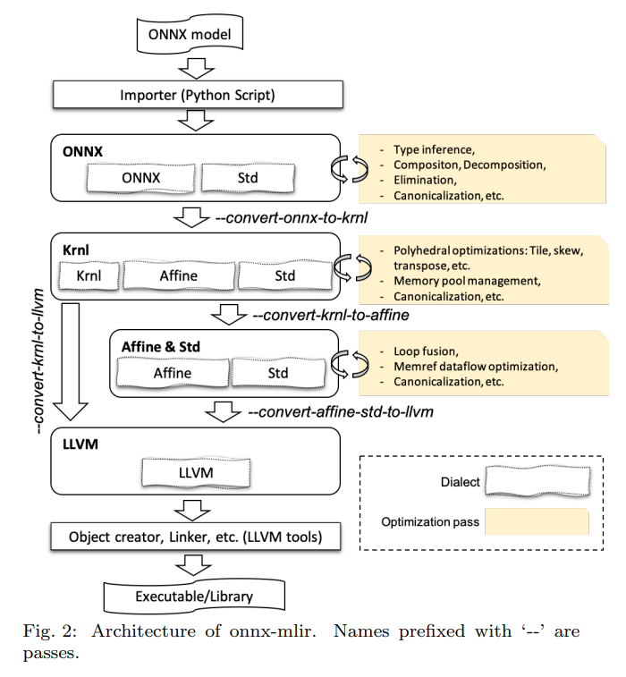

## mlir 笔记
### onnx-mlir 项目
    论文：https://arxiv.org/pdf/2008.08272
    主要使用了 mlir 中的五个方言 onnx, krnl, affine, std, llvm 并对应四个层次
    onnx, krnl 为项目开发的 dialect ，使用了相关 pass 进行语法转换

### affine dialect
    主要用于表示和优化与线性代数操作、循环结构以及内存访问模式相关的计算。
    它专注于处理 线性关系 和 循环优化，尤其是在多维数组、张量和矩阵运算中。
    Affine 方言提供了高效表达和优化这些操作的工具，通常用于 编译器优化 和 自动化的高效代码生成。
