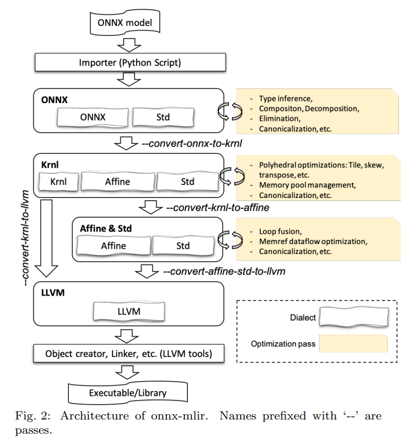

## 学习 onnx-mlir 项目
### 主要内容
    论文：https://arxiv.org/pdf/2008.08272
    主要使用了 mlir 中的五个方言 onnx, krnl, affine, std, llvm 并对应四个层次。
    onnx, krnl 为项目开发的 dialect ，使用了相关 pass 进行语法转换。


### affine dialect
    主要用于表示和优化与线性代数操作、循环结构以及内存访问模式相关的计算。
    它专注于处理 线性关系 和 循环优化，尤其是在多维数组、张量和矩阵运算中。
    Affine 方言提供了高效表达和优化这些操作的工具，通常用于 编译器优化 和 自动化的高效代码生成。

### 源码阅读
```
.
|-- Accelerators
|-- Builder
|-- Compiler # 描述了从 onnx dialect 下降到 llvm dialect 的逻辑
|-- Conversion
|-- Dialect # 自定义方言相关的实现
    |-- Mlir # 定义了构建方言时要用到的有用函数
    |-- Krnl # 里面包含了 Krnl 方言的全部定义，operation, attribution 的声明和定义
    `-- ONNX # 同 Krnl
|-- IR
    `-- AttrBase.td
|-- Interface
|-- Pass
    `-- Passes.hpp # 只有一个 pass 声明的头文件，为了方便在各文件中使用 pass
|-- Runtime
|-- Support
|-- Tools
|-- Transform
|-- Version
`-- onnx-mlir.cpp # 命令行程序 onnx-mlir 入口

```
    其他：
    1. 在 onnx-mlir/src/Dialect/ONNX/ONNXUnsupportedOps.hpp 里列举了目前不支持的 ONNX 操作